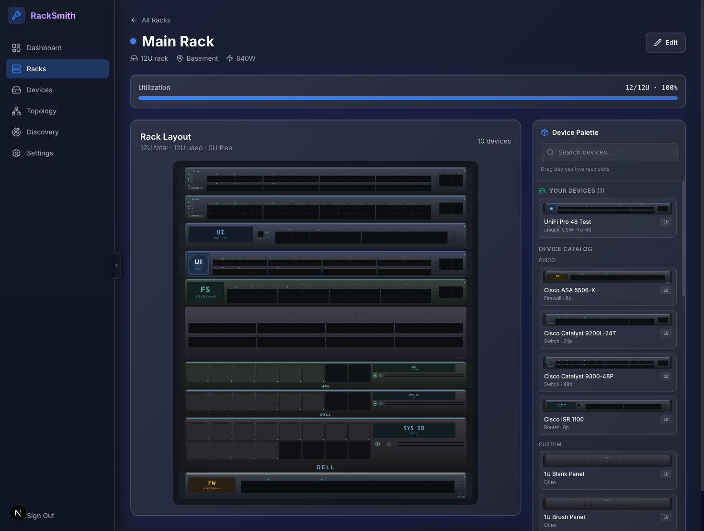
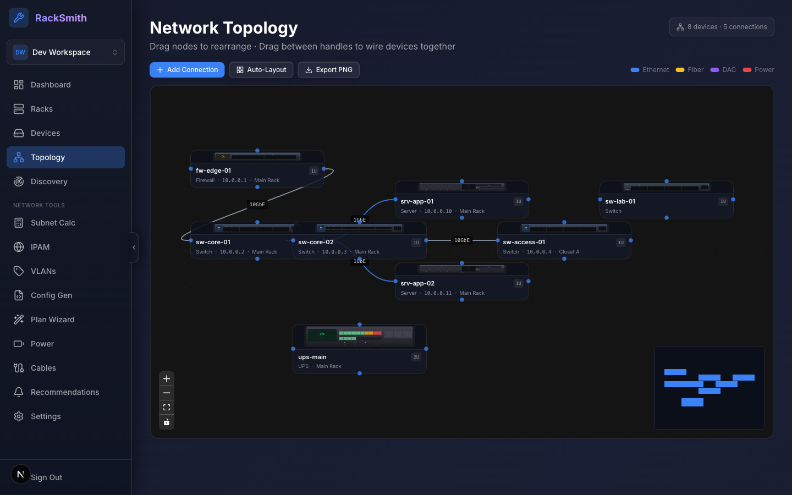
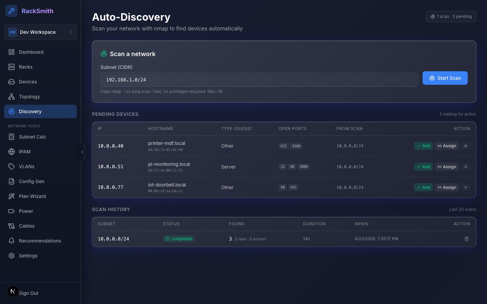
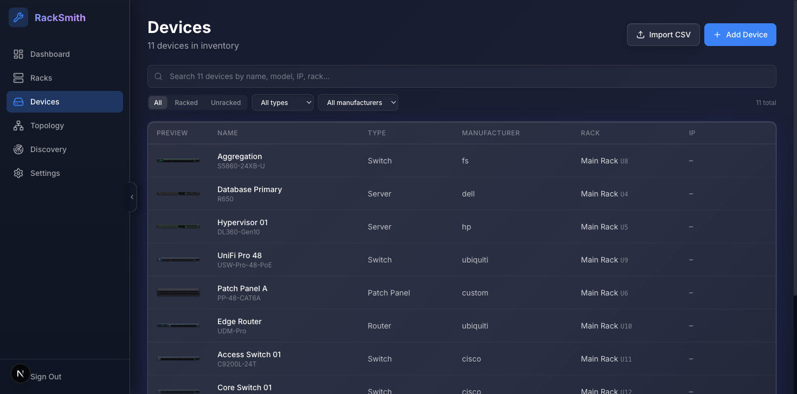

<div align="center">

# RackSmith

### Your infrastructure, beautifully documented.

Rack visualization, device inventory, network topology, and auto-discovery in a single self-hostable app.

[](https://nextjs.org)
[](https://bun.sh)
[](https://www.typescriptlang.org)
[](https://www.prisma.io)
[](https://tailwindcss.com)
[]()



</div>

---

> ### Status: building in private
>
> RackSmith is completing the full v1.5 + v2.0 roadmap (network tools, team
> collaboration, API, SSO, billing, paid self-host licensing) before any
> public launch. The code works today, but it's not being marketed yet. Try
> it for learning or early feedback; don't expect polish guarantees until
> the launch announcement.
>
> See [`CHANGELOG.md`](CHANGELOG.md) for what's shipped.

---

## Features

- Visual rack builder with drag-and-drop U-slot placement and brand-accurate device faceplates.
- Device inventory with a 23-device seeded catalog, custom creation, CSV import, and search/filter/sort.
- Network topology canvas (React Flow) with draggable nodes, typed edges, and PNG export.
- Auto-discovery via nmap ping-scan with a pending-device review queue.
- Subnet calculator plus IPAM for subnets, IP assignments, and DHCP ranges.
- VLANs with per-port assignments and config generation for Cisco IOS, UniFi, and HPE Aruba.
- Plan wizard (4-step, server-persisted, atomic apply) and a recommendations engine with dismissals.
- Power budget (PoE + PDU + UPS) and cable estimator.
- Teams and RBAC: organizations with `owner` / `admin` / `member` / `viewer` roles, member invitations, and ownership transfer.
- Full auth: email/password, GitHub/Google OAuth (optional), TOTP 2FA with backup codes and trusted devices, password reset, email verification, session list with sign-out-all, audit log.
- Self-hostable via multi-stage Dockerfile and `docker-compose.prod.yml`. Migrations run on boot; seeding is optional.

### Public API (beta)

A REST API at `/api/v1/` covers Racks and Devices CRUD with org-scoped API keys managed in Settings. Authentication is bearer-token, rate limiting is DB-backed (sliding window) with `X-RateLimit-*` response headers. Interactive docs render via Scalar at `/api/v1/docs`, and the OpenAPI 3.1 spec is at `/api/v1/openapi.json`. Breaking changes are possible until GA.

## Pricing

Three tiers. Free is functional for most homelabs; Pro and Business unlock scale and team features.

| Tier | Price | Limits |
|---|---|---|
| Free | $0 forever | 1 site, 3 racks, unlimited devices, full core feature set |
| Pro | $9/mo (post-launch) | Unlimited sites and racks, team members, API, exports |
| Business | $29/user/mo (post-launch) | Multi-tenant, white-label, SSO, advanced audit |

Self-hosters get the Free tier with no license required. Pro and Business are hosted-only at launch; paid self-host licensing (signed JWT with instance-fingerprint binding) is planned for Phase 16. See the `/#pricing` section on the landing page for the full feature matrix.

## Known limitations (pre-launch)

- OAuth requires your own provider apps. Buttons appear only when `GITHUB_CLIENT_ID` / `GOOGLE_CLIENT_ID` are set. See [OAuth sign-in](#oauth-sign-in-optional) below.
- Email delivery defaults to a console logger in dev. When `RESEND_API_KEY` is unset, password-reset and verification mails print to stderr instead of sending. Set `RESEND_API_KEY` in production.
- Better Auth rate limits (login, 2FA, password reset) live in memory, so multi-instance deployments can leak past those limits. The Phase-11 API rate limit is DB-backed and unaffected. Switch Better Auth to `storage: "database"` if you need horizontal scaling.
- Paid self-hosting isn't available at launch. Pro/Business features run on the hosted service only until Phase 16 ships the licensing system.

## Screenshots

| | |
|:---:|:---:|
|  |  |
| Rack Builder | Network Topology |
|  |  |
| Auto-Discovery | Device Inventory |

## Quick start (Docker Compose)

Requirements: Docker with `docker compose`. Install `nmap` on the host if you want auto-discovery.

```bash
git clone https://github.com/NindroidA/racksmith.git
cd racksmith
cp .env.example .env
# Generate a Better Auth secret and paste it as BETTER_AUTH_SECRET in .env
openssl rand -hex 32

docker compose up
```

Open <http://localhost:3000> and register an account.

To seed the device catalog (Cisco, Dell, HPE, Ubiquiti, etc.):

```bash
docker compose exec app bunx prisma db seed
```

## Development setup

Requirements: [Bun](https://bun.sh) 1.x, Docker, `nmap` (for discovery).

```bash
# Clone and install
git clone https://github.com/NindroidA/racksmith.git
cd racksmith
bun install

# Configure environment
cp .env.example .env
# Set BETTER_AUTH_SECRET (openssl rand -hex 32) in .env

# Start Postgres
docker compose up -d db

# Run migrations and seed the catalog
bunx prisma migrate dev
bunx prisma db seed

# Start the dev server
bun dev
```

Open <http://localhost:3000>.

### Dev login

In non-production environments, `bunx prisma db seed` also creates a login at `dev@racksmith.local` / `devpassword`, pre-seeded as the owner of a Pro-tier "Dev Workspace" organization. Skip the signup flow and start exploring immediately.

### OAuth sign-in (optional)

OAuth buttons show on the login/signup pages only when their credentials are set. Email + password always works; OAuth is additive.

**GitHub** — [Create an OAuth App](https://github.com/settings/developers) with homepage `http://localhost:3000` (or your production URL) and authorization callback `http://localhost:3000/api/auth/callback/github`.

**Google** — [Create OAuth 2.0 credentials](https://console.cloud.google.com/apis/credentials) of type "Web application" with authorized redirect URI `http://localhost:3000/api/auth/callback/google`.

Then add the client IDs and secrets to `.env`:

```bash
GITHUB_CLIENT_ID="..."
GITHUB_CLIENT_SECRET="..."
GOOGLE_CLIENT_ID="..."
GOOGLE_CLIENT_SECRET="..."
```

In production, replace `localhost:3000` with your domain (both in the provider console and `BETTER_AUTH_URL`). Restart after changing `.env`.

### Production deploy

Ships as a Docker image with a multi-stage build (deps, builder, runner), Next.js standalone output, non-root user, and a built-in healthcheck.

```bash
# 1. Prepare .env with the required secrets
cat > .env.prod <<'EOF'
POSTGRES_PASSWORD=<strong random password>
BETTER_AUTH_SECRET=<openssl rand -hex 32>
BETTER_AUTH_URL=https://racksmith.yourdomain.com
APP_PORT=3000
RACKSMITH_SEED=1         # seed the device catalog on first boot; set 0 after
EOF

# 2. Spin up the stack (postgres + app)
docker compose -f docker-compose.prod.yml --env-file .env.prod up -d

# 3. Health check
curl http://localhost:3000/api/health
# → {"status":"ok","checks":{"database":{"ok":true},"migrations":{"ok":true,"applied":N}}}
```

The entrypoint waits for Postgres, runs `prisma migrate deploy`, optionally seeds, then starts the standalone server. Migrations are idempotent, so re-deploy is safe.

Behind a reverse proxy (recommended): terminate HTTPS at nginx/Caddy/Traefik and proxy to `app:3000`. Set `BETTER_AUTH_URL` to your public HTTPS URL. The app sets HSTS when `NODE_ENV=production`.

Postgres backups: the `pgdata` volume holds all your data. Back it up regularly with `docker compose -f docker-compose.prod.yml exec db pg_dump -U racksmith racksmith > backup.sql`.

Full guide: [`docs/SELF_HOSTING.md`](docs/SELF_HOSTING.md).

### Common commands

| Command | What it does |
|---|---|
| `bun dev` | Start the Next.js dev server on port 3000 |
| `bun run build` | Production build |
| `bun run typecheck` | TypeScript check (no emit) |
| `bun run test` | Vitest suite |
| `bunx prisma migrate dev` | Apply schema changes |
| `bunx prisma db seed` | Seed the device catalog + dev user (non-prod) |
| `bunx prisma studio` | Visual DB browser |

## Tech stack

| Layer | Choice |
|---|---|
| Framework | Next.js 16 (App Router, server components, server actions) |
| Runtime | Bun |
| Language | TypeScript 6 (strict) |
| Styling | Tailwind CSS 4 (CSS-first config) |
| Animation | Framer Motion |
| Database | PostgreSQL 17 |
| ORM | Prisma 6 |
| Auth | Better Auth 1.6 (email + OAuth + 2FA) |
| API docs | Scalar + OpenAPI 3.1 (via `@asteasolutions/zod-to-openapi`) |
| Canvas | @xyflow/react (React Flow) |
| Icons | Lucide React |
| Toasts | react-hot-toast |
| Network scan | nmap (via child_process, grepable output) |
| Testing | Vitest |
| Deployment | Docker Compose (self-hosted) |

## Architecture

- Server components for all authenticated pages.
- Server actions for every mutation, validated with Zod, with auth via `requireMember(role)`.
- Proxy-based route protection in `src/proxy.ts` (Next.js 16 pattern). `/api/v1/*` bypasses the session-cookie redirect for bearer-token clients.
- Multi-tenancy uses PostgreSQL Row-Level Security. Every query on a tenant-scoped table runs inside `withTenant(organizationId, ...)`, which sets the PG session variable RLS reads. Forced RLS at the DB layer means an un-wrapped query returns empty rows, not another tenant's data.
- Tier-checked creates (racks, devices, subnets, VLANs, plans, API keys) use `canCreate*Locked` helpers that acquire a `pg_advisory_xact_lock` so concurrent creates serialize against the cap.
- The `/api/v1/` routes share a small route factory that handles auth, rate limiting, error envelopes, and request logging in one place.
- Device graphics are SVG faceplates at a real 10.86:1 aspect ratio per U, with nine brand palettes tuned for the dark theme.
- Discovery uses fire-and-forget nmap processes; the client polls scan status.

## Project status

| Shipped | Next |
|---|---|
| Phases 1–6 — Foundation, racks, device visualization, inventory, auto-discovery, topology, pre-launch polish | Phase 12 — Export suite |
| Phase 6.5 — Cross-cutting UX foundations | Phase 13 — Advanced audit viewer |
| Phase 7 — Subnet + IPAM + DNS *(v1.5)* | Phase 14 — SSO via OIDC |
| Phase 8 — VLANs + config generator *(v1.5)* | Phase 15 — Stripe billing + hosted tier |
| Phase 9 — Plan wizard, recommendations, power budget, cable estimator *(v1.5)* | Phase 16 — Self-host paid licensing |
| Phase 10 — Teams / Organizations / RBAC *(v2.0)* | Phase 17 — Launch prep |
| Phase 11 — Public REST API + keys *(v2.0)* | Phase 18 — Public launch |

## Contributing and security

- [CONTRIBUTING.md](CONTRIBUTING.md) — what we accept during the v1 beta window
- [SECURITY.md](SECURITY.md) — how to report a vulnerability (not via public issues)
- [CHANGELOG.md](CHANGELOG.md) — what's shipped in each release
- [docs/SELF_HOSTING.md](docs/SELF_HOSTING.md) — full production deploy guide

## License

MIT License — see [LICENSE](LICENSE).

## Credits

Built by [Andrew Curtis](https://github.com/NindroidA) at [Nindroid Systems](https://nindroid.systems).

Brand inspiration from public product pages: Cisco Catalyst, Ubiquiti UniFi, Dell PowerEdge, HPE ProLiant, TrippLite SmartOnline. RackSmith's renderings are abstracted typographic marks and stylized SVG; no logos or proprietary assets are used.

Acknowledgments: Nielsen Norman Group (progressive disclosure patterns), r/homelab and r/networking (pain-point insights), Linear team (dark-mode design philosophy). Device aspect ratios sourced from Wikipedia's [19-inch rack](https://en.wikipedia.org/wiki/19-inch_rack) article.
